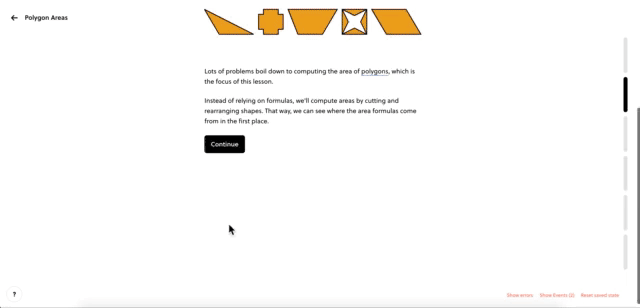

# Basic Lane

!!!tldr "Rule"
    The basic, single-lane format is simple and direct. If content makes sense in a single lane, use the basic layout. It is the default format for a Brilliant lesson.

??? example "Basic Lane Example"
    [Link](https://brilliant.org/courses/geometry-fundamentals/area/polygon-areas/2/?version_id=2214)
    <figure markdown>
      
    </figure>
