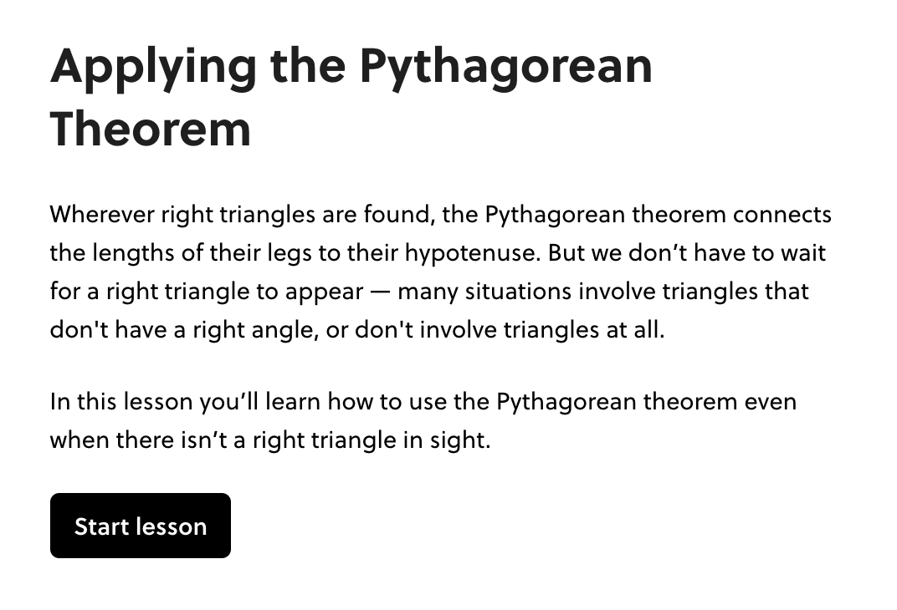
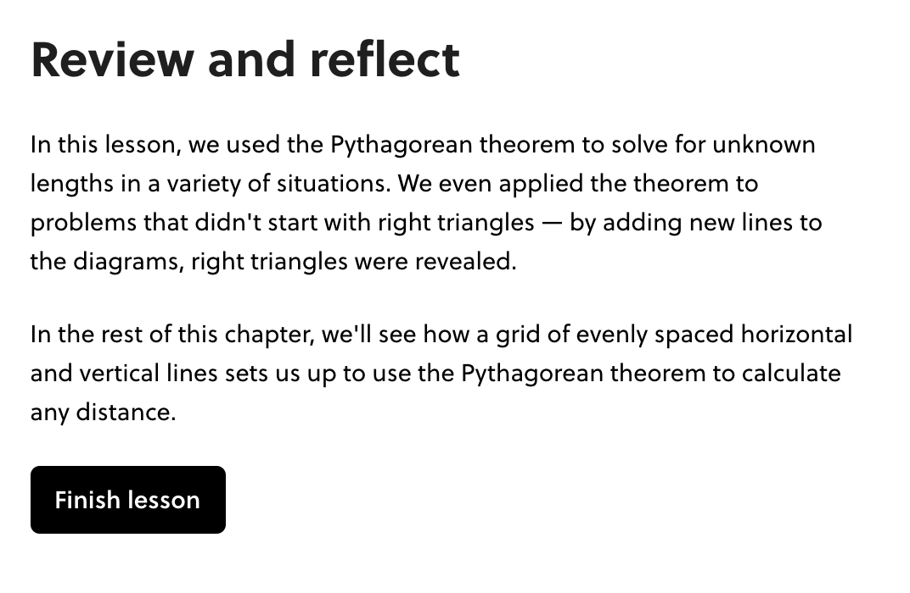

# Bookends

!!!tldr "Rule"
        Bookends begin and end every lesson on Brilliant. They preview and summarize the lesson's purpose in non-technical and succinct language. They are never more than a few sentences.

- Bookends are signposts that orient the learner between lessons. They do not contain a full picture of the lesson. Rather, they highlight the essentials and invite the learner to keep going.
- The focus of the **opening bookend** is telling the learner what they will do in the current lesson.
- The opening bookend can mention content in earlier lessons, but this is not its main purpose.

    ??? example "Opening Bookend Example"
        [Link](https://brilliant.org/courses/geometry-fundamentals/pythagoras-geometry-3/applying-the-pythagorean-theorem/1/)
        <figure markdown>
          
        </figure>

- The **closing bookend** focuses on highlighting what the learner did in the lesson, mirroring the language of the opening bookend.
- If there's room, the closing bookend can look ahead to the next lessons to compel the learner to move forward.

    ??? example "Closing Bookend Example"
        [Link](https://brilliant.org/courses/geometry-fundamentals/pythagoras-geometry-3/applying-the-pythagorean-theorem/4/)
        <figure markdown>
          
        </figure>
