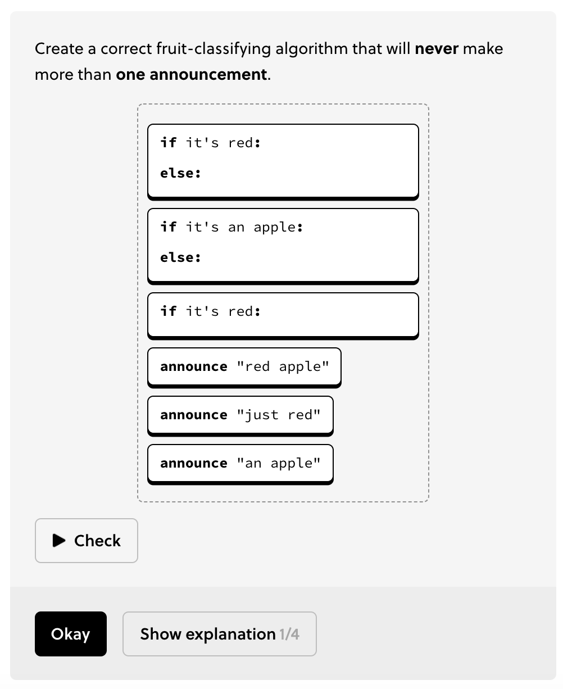
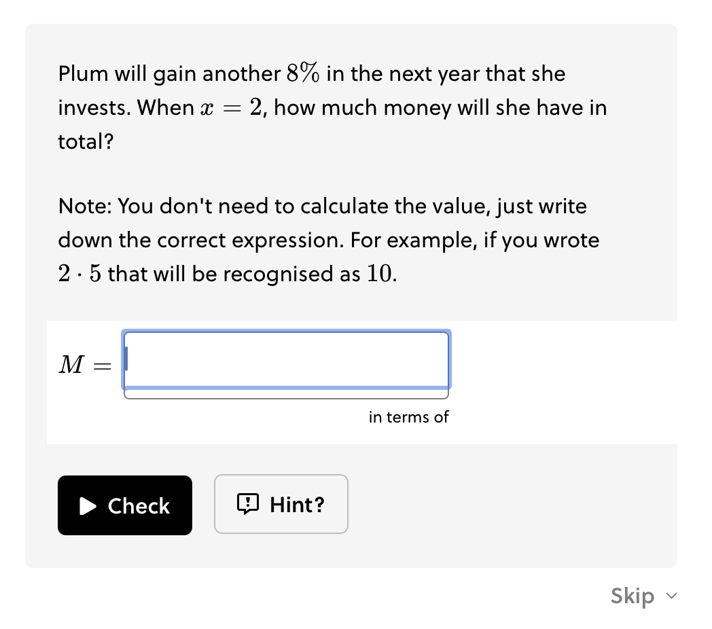

# Interactive Solvables

!!!tldr "Rule"
The question setup text lives outside the solvable box. Only the interactive objective lives inside the box.

- The objective is stated inside the solvable box.
- If there is setup text, it appears above the solvable box.
- If an image accompanies the interactive solvable, then the image should be in the left lane and the interactive solvable on the right. Otherwise, images should be placed above the solvable box.

??? example "Interactive Solvable"
    [Link](https://brilliant.org/courses/computer-science-algorithms/building-blocks-v3/conditionals/6)
    <figure markdown>
      
    </figure>

- Don't remind learners how the UI works. It is the job of the UI to make itself clear, and the writer's role to use it consistently, so learners know what to expect.

- Don't remind people about interactive features defensively. If something turns out to be a problem in playtesting, we can handle that in the interactive itself.

    ??? failure "Example"
        [Link](https://brilliant.org/courses/computer-science-algorithms/building-blocks-v3/conditionals/6)
        <figure markdown>
        
        </figure>
