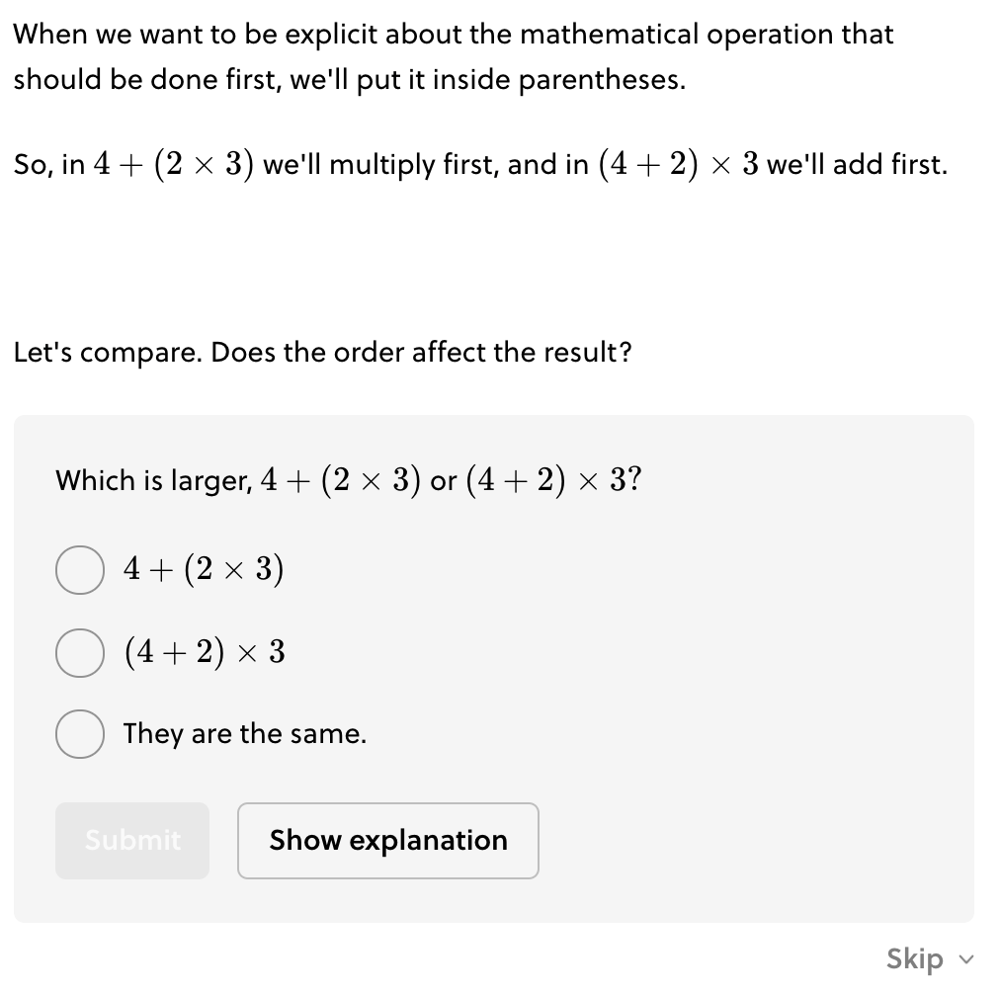
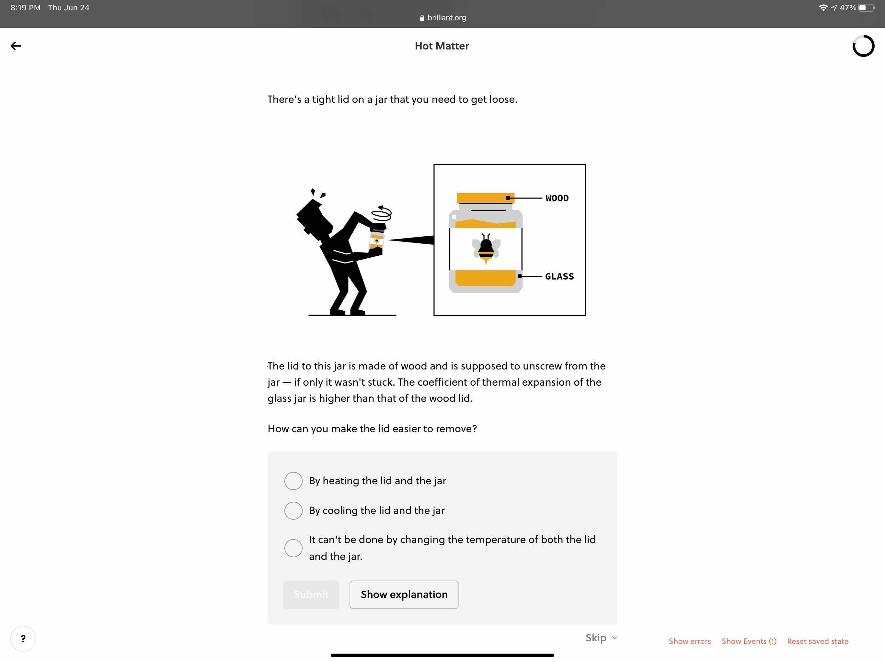
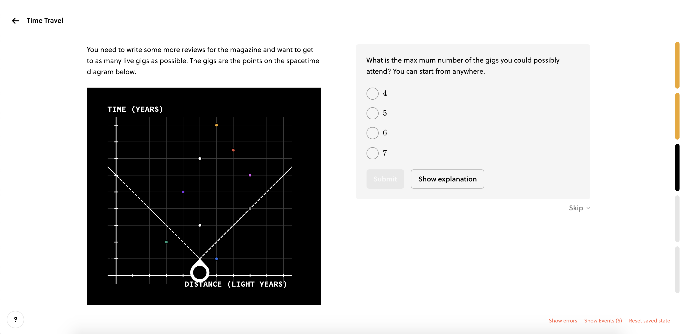

# MCQs

!!!tldr "Rule"
        When the question is an MCQ, the question setup text lives outside the solvable box. Only the question statement lives inside the box.

- The setup and motivation for the question is outside the solvable box.
- Only the question statement is inside the box.
- If a question in your lesson requires more details or assumptions, these should be woven into the preceding text.
- **Hints** shouldn't be stated in the text. Instead, use the `? hint` command in Camperdown

    !!! success "[Example](https://brilliant.org/courses/pre-algebra/variables-and-notation-2/order-of-operations/2/?version_id=2028)"

        <figure markdown>
        
        </figure>

!!!tldr "Rule"
    For MCQs that reference an image, the reference image or interactive lives outside the solvable box.

- If the displaying the image and question doesn't put the image off screen, a single lane is fine.

    !!! success "[Example](https://brilliant.org/courses/puzzle-science/flow-3/heat-in-matter-2-diagrammar/4/?version_id=1953)"

        <figure markdown>
        
        </figure>

- If the image/interactive would run off the screen in single-lane, then move to double-lane format with the solvable in the right lane — unless **multiple questions** refer to the same image or interactive (see [splitlanes guidance](Split-lane%20Mode%2047b2086a4a774a068ba243cf717cde43.md)).

    !!! success "[Example](https://brilliant.org/courses/puzzle-science/relativity-2/time-travel/3/?version_id=2066)"

        <figure markdown>
        
        </figure>
