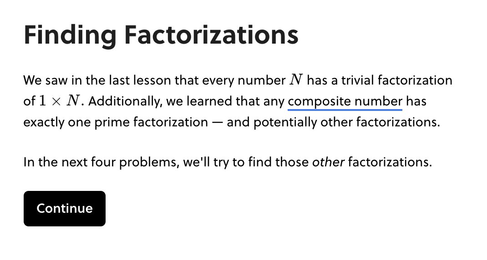

!!! tldr "Rule"

    Blocks organize the conceptual progress of a lesson. Each block should build to one major result or concept.

A block $\operatorname{ker} f=\{g\in G:f(g)=e_{H}\}{\mbox{.}}$ contains a complete concept or argument. At the conclusion of the block, the learner should be able to identify they have gained a new skill, tool, or concept. Accordingly, the learner has attempted several questions that support the main idea of the block.

The **beginning of a block** announces the main idea in light of the preceding content. If terminology from a previous block or lesson is needed, it is woven into the text here. All blocks begin with an informative heading.

- The first step of a block calls back to the previous block, and includes a **glossary card** for reference in this block.
- Blocks begin with headings that signal to the learner what to expect in this block.
- Navigating back and forth between blocks is not simple. In the beginning of a block, you should include all information the learner needs to navigate the block successfully — even if it introduces some redundancy in the lesson.

{ align=left }

{align=left}

The **middle of the block** builds up an idea through a combination of questions and explanations. New terminology is introduced. Callbacks to earlier parts of the lesson are expected. There should be no question-less blocks, except for bookends.

- We do not use subheadings for organization within a block; a need for subheadings suggests your block should split into multiple blocks.
- **Examples**

    

    

The **end of the block** distills the main idea as a **boxed concept**. The main idea should be highlighted by a concept box. Reinforcing questions optionally appear after the concept box. The last step of a block should extend a bridge to the next block.

- **[Example without a question](https://brilliant.org/courses/intro-neural-networks/neurons-2/decision-box-2/5/?version_id=1474)**

    

    - The concept is drawn from the previous questions and boxed, with a glossary card on the important term: "AND gate."
    - The final step summarizes what the learner accomplished, and looks ahead with the final sentence.
- **[Example with a question](https://brilliant.org/courses/math-fundamentals/numerical-reasoning-2/divisibility-visual/6/?version_id=2093)**

    

    

    - Like in the last example, the concept is extracted from the previous questions. It is a general statement of what the learner has done.
    - This block concludes with a final question that follows from the concept.
    - Still, it is best practice to conclude the block with a sentence anticipating the content of the next block.
