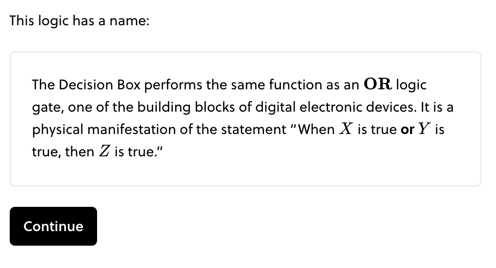
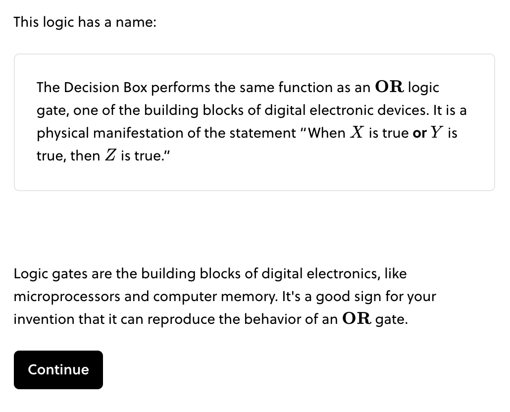
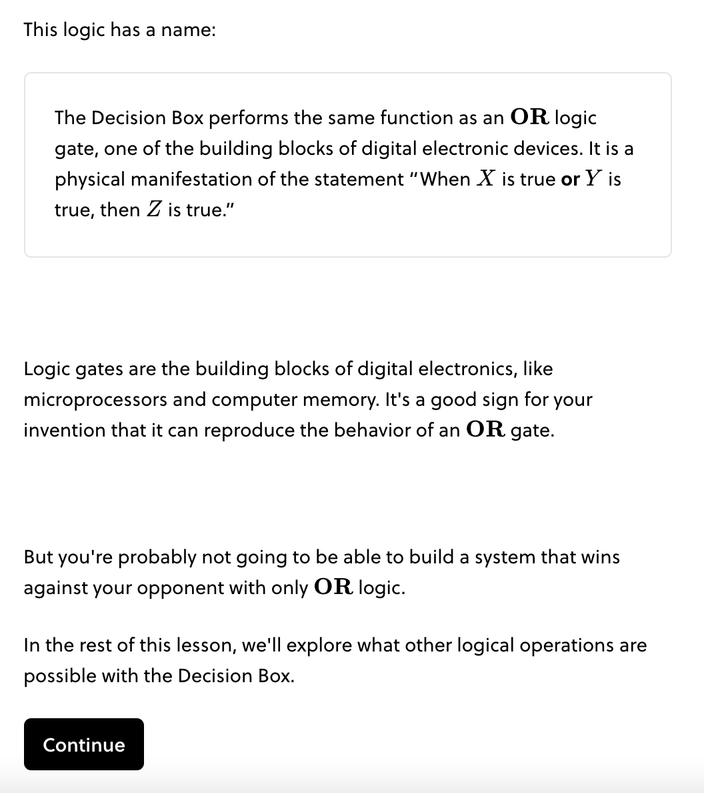

!!! tldr "Rule"

    Blocks organize the conceptual progress of a lesson. Each block should build to one major result or concept.

A block contains a complete concept or argument. At the conclusion of the block, the learner should be able to identify they have gained a new skill, tool, or concept. Accordingly, the learner has attempted several questions that support the main idea of the block.

### Beginning of Block

The beginning of a block announces the main idea in light of the preceding content. If terminology from a previous block or lesson is needed, it is woven into the text here. All blocks begin with an informative heading.

Navigating back and forth between blocks is not simple. In the beginning of a block, you should include all information the learner needs to navigate the block successfully — even if it introduces some redundancy in the lesson.

??? example
    The first step of this block calls back to earlier content, and includes a [glossary card](../formatting/glossary.md) for reference in this block.

    <figure markdown>
      { width="500" }
    </figure>

### Middle of Block

The middle of the block builds up an idea through a combination of questions and explanations. New terminology is introduced. Callbacks to earlier parts of the lesson are expected. There should be no question-less blocks, except for bookends.

We do not use subheadings for organization within a block. Subheadings suggests your block should split into multiple blocks.

### End of Block

The end of the block distills the main idea, highlighted by a concept box. Reinforcing questions or remarks optionally appear after the concept box. The last step of a block should extend a bridge to the next block.

??? example "Example"

    === "Step With Boxed Concept"

        <figure markdown>
            { width="500" }
        </figure>

    === "Step with Remark"

        <figure markdown>
            { width="500" }
        </figure>

    === "Step Looking Ahead"

        <figure markdown>
            { width="500" }
        </figure>
