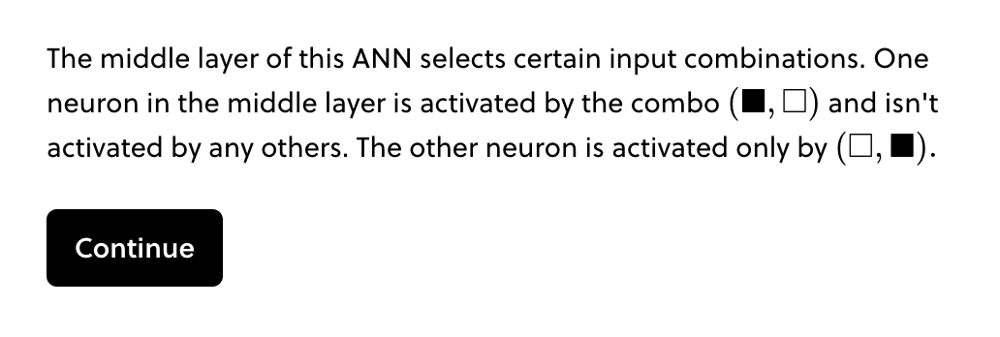
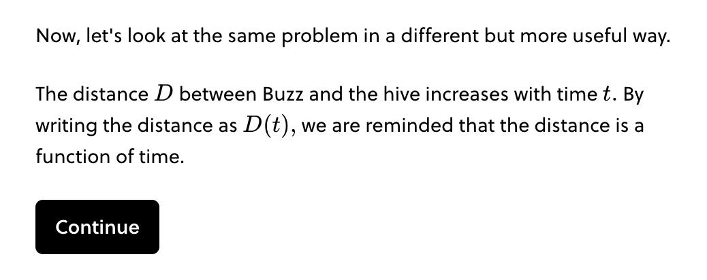
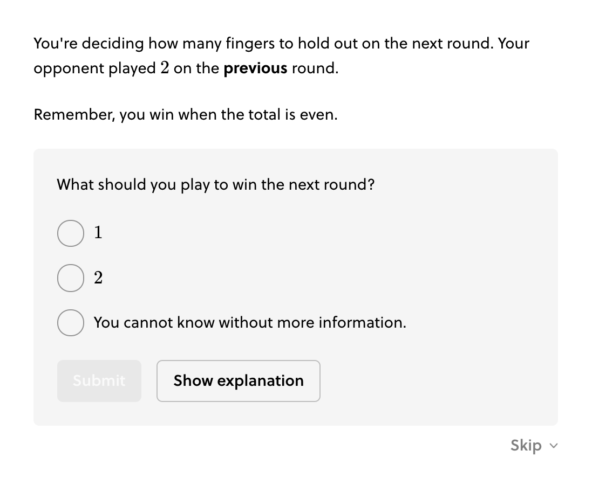
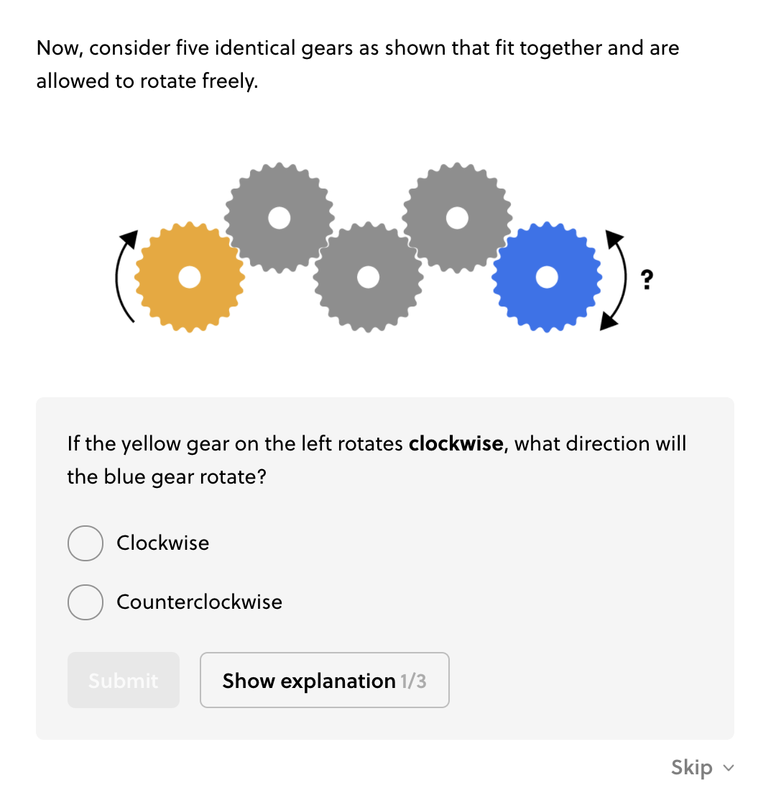
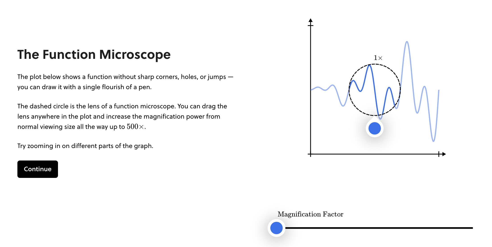

!!!tldr "Rule"
    A step can be a single sentence or a few sentences. Steps are the basic increment of content and should advance a single, complete thought. For each step, it should be entirely clear what is being advanced.

!!! success "Basic Example"
    - This step elaborates on a single idea: "The middle layer of this ANN selects certain input combinations."
    - Most steps should not be longer than this one.

    <figure markdown>
    {width=500}
    </figure>

- If one of the sentences is a transitional sentence, use a **line break** between sentences.

    !!! success "With Line Break"
        - This step elaborates on a single idea: "The distance $D$ between Buzz and the hive increases with time $t$."
        - This step includes some transitional text, which is displayed on a separate line. Transitional text may come before or after the main idea of a step.

        <figure markdown>
        {width=500}
        </figure>

A step may contain an MCQ or lightweight question. The text in the step should introduce or include the setup information for the question. If the question is an MCQ, only the question text should appear in the solvable box. If the supporting text doesn't make sense as a complete thought, it should be displayed in the same step as the MCQ

!!! success "[Example with question and text](https://brilliant.org/courses/intro-neural-networks/neurons-2/decision-box-2/3/?version_id=1474)"
    - The supporting text above the solvable box is needed to solve the problem, and is short enough to be part of the same step as the MCQ.
    - For questions with more supporting text, the text may be split across several steps. Try to construct these steps so that they advance single, complete thoughts leading up to the question.

    <figure markdown>
    {width=500}
    </figure>

- A step with an image can take up a lot of vertical space. Try to arrange for the entire step (image + text) to appear on the screen without requiring the learner to scroll. This may require putting the image into the right lane, or introducing the image with minimal text.

    !!! success "[Example with image, text, and question](https://brilliant.org/courses/puzzle-science/structure-3/gears-diagrmmar-2/2/)"
        - It is possible to format a step with an MCQ, short supporting text, and an image. This is a common pattern.
        - If the step is taller than the screen, and the question is partly off-screen upon reveal, it's not a terrible experience for the learner. Sometimes this is the only layout solution.
        - However, a better solution is to move the MCQ to the sidekick lane.
        <figure markdown>
        {width=500}
        </figure>

- Here, the MCQ is placed in the sidekick lane because the text, image, and MCQ are too tall for a single lane.
    !!! success "[Example with sidekick](https://brilliant.org/courses/calculus-nutshell-diagrammar/derivatives-7/what-derivative/3/?version_id=2082)"
        <figure markdown>
        {width=500}
        </figure>
